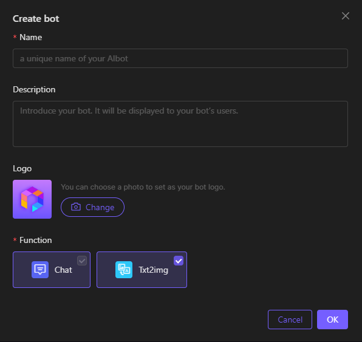

# Tutorial

***

## Step 1: Create a bot 

* Log in to [<mark style="color:purple;">JarvisBot</mark>](https://jarvisbot.emchub.ai/)<mark style="color:purple;">.</mark>
* Click **Create.**

<figure><figcaption></figcaption></figure>

* Enter a name and description for the bot.
* Select service provider "**Discord**" or "**Telegram**" and verify the token.
* Verify EMC App ID and EMC App Token.
* Choose function "**Chat**" and "**TXT2IMG**" ,then you can create a bot.

## Step 2: Enable your bot 

* Right-click **More**.
* Click **Start** to activate the bot.

<figure><figcaption></figcaption></figure>

***

## Step 3: Link your Q\&A Base 

1. Right-click **More**.
2. Click **Link Q\&A Base**
3. Select a Q\&A Base to the bot.

<figure><figcaption></figcaption></figure>


If you don't have any Q\&A base, you can also use the bot.


***

## Step 4: Link your Knowledge Base 

1. Right-click **More** button.
2. Click **Link Knowledge**
3. Select a Knowle Base to the bot.


If you don't have any knowledge base, you can also use the bot.


